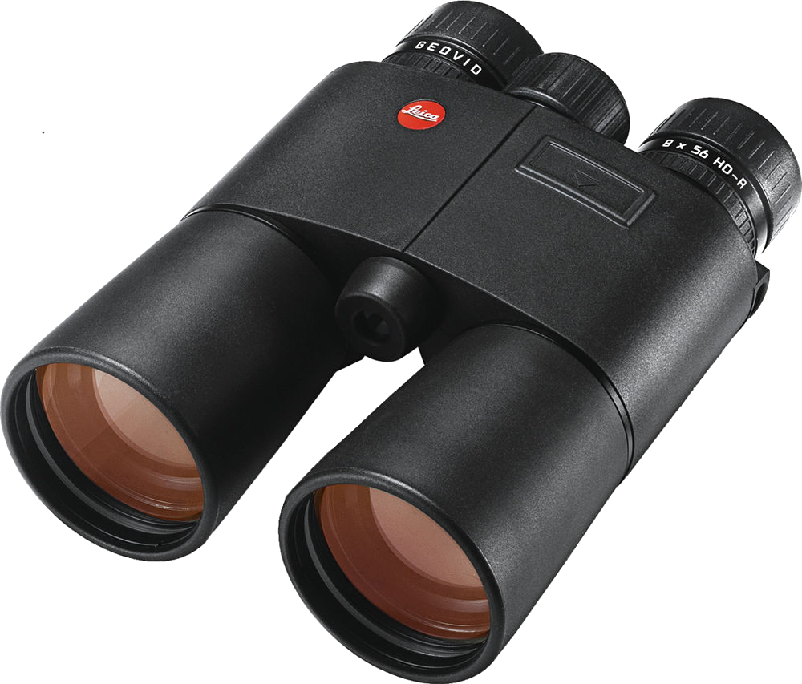
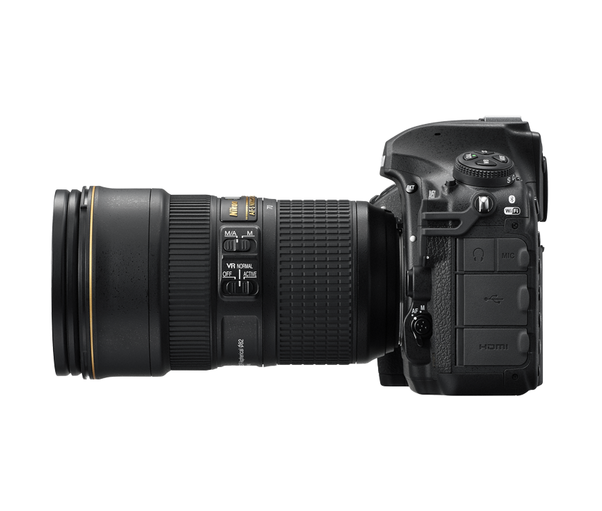

---?image=assets/img/neowise3.jpg

@snap[east span-80]
# KOMET **NEOWISE**
@snapend

---?image=assets/img/neowise1.jpg

---
# C/2020 F3

---?image=assets/img/PIA12011.jpg?position=bottom&size=40%

@snap[north span-100]
# NEO**WISE**
@snapend

---

## BEOBACHTUNG

---?image=assets/img/Komet-Morgenhimmel.png

---?image=assets/img/Komet-Abendhimmel.png

---

@snap[west span-50]

@snapend

@snap[east span-50]
## Fernglas
@snapend

---

@snap[east span-50]

@snapend

@snap[west span-50]
## Kamera
@snapend

---

## WETTER

---

<iframe src="https://www.meteoblue.com/de/wetter/widget/seeing/hof_deutschland_2902768?geoloc=fixed&noground=0"  frameborder="0" scrolling="NO" allowtransparency="true" sandbox="allow-same-origin allow-scripts allow-popups allow-popups-to-escape-sandbox" style="width: 520px; height: 698px"></iframe>
<!-- DO NOT REMOVE THIS LINK --><a href="https://www.meteoblue.com/de/wetter/vorhersage/seeing/hof_deutschland_2902768?utm_source=weather_widget&utm_medium=linkus&utm_content=seeing&utm_campaign=Weather%2BWidget" target="_blank">meteoblue</a>

---

<iframe src="https://www.meteoblue.com/de/wetter/widget/daily/hof_deutschland_2902768?geoloc=fixed&days=7&tempunit=CELSIUS&windunit=KILOMETER_PER_HOUR&precipunit=MILLIMETER&coloured=coloured&pictoicon=0&pictoicon=1&maxtemperature=0&maxtemperature=1&mintemperature=0&mintemperature=1&windspeed=0&windspeed=1&windgust=0&winddirection=0&winddirection=1&uv=0&humidity=0&precipitation=0&precipitation=1&precipitationprobability=0&precipitationprobability=1&spot=0&spot=1&pressure=0&layout=dark"  frameborder="0" scrolling="NO" allowtransparency="true" sandbox="allow-same-origin allow-scripts allow-popups allow-popups-to-escape-sandbox" style="width: 378px; height: 364px"></iframe>
<!-- DO NOT REMOVE THIS LINK --><a href="https://www.meteoblue.com/de/wetter/woche/hof_deutschland_2902768?utm_source=weather_widget&utm_medium=linkus&utm_content=daily&utm_campaign=Weather%2BWidget" target="_blank">meteoblue</a>

---

## INFORMATIONEN
#### www.sternwarte-hof.de/de/komet-neowise

---